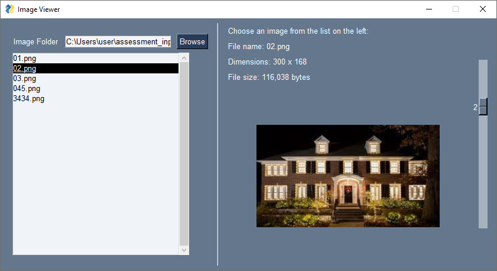
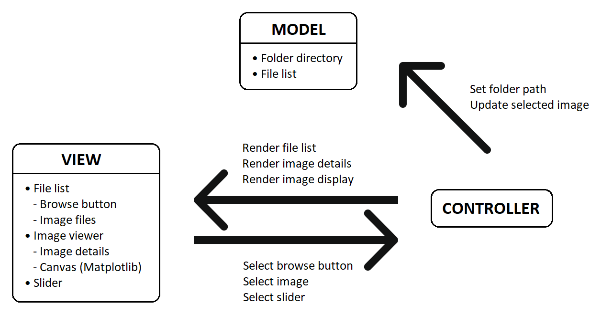

# Image Viewer

Simple image viewer to display images using [PySimpleGUI](https://pysimplegui.readthedocs.io/en/latest/).



## Getting Started

Install libraries

```bash
pip install pysimplegui
pip install matplotlib
```

To start, run:

```bash
python img_viewer.py
```

## User Interface

- Select a folder containing images (`.png`/`.gif`) using the `Browse` button or manually enter the directory path.
- Image files will be loaded onto the left panel.
- Use the slider on the left panel to go through the files in the folder.
- Select an image to display it on the right panel.
- Use the slider on the right panel to cycle through the images displayed.
- Image details (name, dimensions, etc) are displayed above the image.

## Data Flow & Code Interaction


